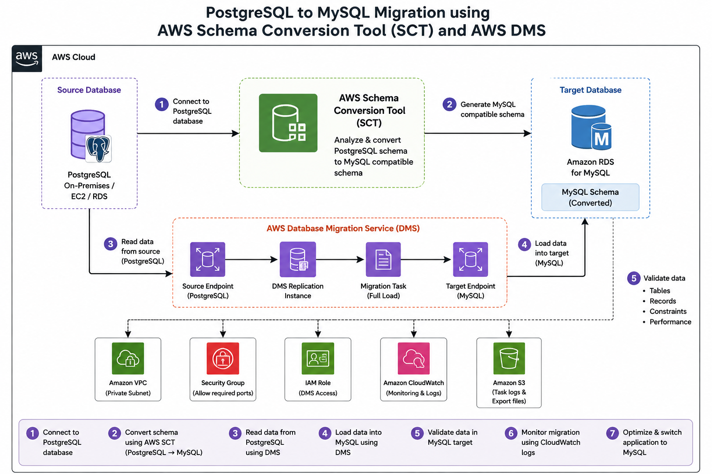

# MySQL to PostgreSQL Migration Using AWS SCT and AWS DMS

## 📌 Project Overview

This project demonstrates a heterogeneous database migration from **MySQL to PostgreSQL** using **AWS Schema Conversion Tool (SCT)** and **AWS Database Migration Service (DMS)**.

The project uses:

* **MySQL RDS** as the source database
* **AWS Schema Conversion Tool (SCT)** for schema conversion
* **AWS Database Migration Service (DMS)** for data migration
* **PostgreSQL RDS** as the target database

The migration process converts the MySQL database schema into a PostgreSQL-compatible schema and then migrates the data from MySQL to PostgreSQL.

---

## 🏗️ Architecture




---

## 🔄 Migration Flow

```text
MySQL RDS
   │
   ├── Schema
   │
   ▼
AWS SCT
   │
   ├── Analyze MySQL Schema
   ├── Convert Schema
   │
   ▼
PostgreSQL RDS
   │
   ▲
   │ Data
   │
AWS DMS
   │
   ├── Source Endpoint
   ├── Replication Instance
   ├── Migration Task
   └── Target Endpoint
```

---

## ☁️ AWS Services Used

| Service         | Purpose                                               |
| --------------- | ----------------------------------------------------- |
| Amazon RDS      | Hosts MySQL and PostgreSQL databases                  |
| AWS SCT         | Converts MySQL schema to PostgreSQL-compatible schema |
| AWS DMS         | Migrates data from MySQL to PostgreSQL                |
| IAM             | Provides required AWS permissions                     |
| VPC             | Provides network infrastructure                       |
| Security Groups | Controls database connectivity                        |
| CloudWatch      | Used for monitoring and logs                          |
| Amazon S3       | Can be used for task logs/export files                |

---

## 🗄️ Source Database

The source database is **MySQL running on Amazon RDS**.

Example database:

```sql
CREATE DATABASE source_ecommerce;
```

A migration user can be created with:

```sql
CREATE USER 'sct_user'@'%' IDENTIFIED BY 'Password@123';

GRANT ALL PRIVILEGES
ON source_ecommerce.*
TO 'sct_user'@'%';

FLUSH PRIVILEGES;
```

### Sample Table

```sql
CREATE TABLE departments (
    department_id INT AUTO_INCREMENT PRIMARY KEY,
    department_name VARCHAR(50) NOT NULL UNIQUE,
    location VARCHAR(50) DEFAULT 'Main Campus'
);
```

### Sample Data

```sql
INSERT INTO departments (department_name, location)
VALUES
('Engineering', 'Building A'),
('Data Science', 'Building A'),
('Human Resources', 'Building B'),
('Marketing', 'Remote'),
('Finance', 'Building B');
```

---

## 🎯 Target Database

The target database is **PostgreSQL running on Amazon RDS**.

Example:

```sql
CREATE DATABASE target_ecommerce;
```

Create the migration user:

```sql
CREATE USER sct_user
WITH PASSWORD 'Password@123';

GRANT ALL PRIVILEGES
ON DATABASE target_ecommerce
TO sct_user;
```

---

# 🛠️ Migration Implementation

## Step 1 — Install AWS SCT

Install the **AWS Schema Conversion Tool**.

AWS SCT is used to analyze the source MySQL database and convert its schema into a PostgreSQL-compatible schema.

You also need the appropriate:

* MySQL JDBC driver
* PostgreSQL JDBC driver

---

## Step 2 — Configure SCT Drivers

Open AWS SCT:

```text
Settings
   ↓
Global Settings
   ↓
Drivers
```

Configure the paths for:

```text
MySQL JDBC Driver
PostgreSQL JDBC Driver
```

Click:

```text
Apply → OK
```

---

## Step 3 — Create RDS Databases

Create two Amazon RDS databases:

### Source

```text
Engine: MySQL
Purpose: Source Database
Port: 3306
```

### Target

```text
Engine: PostgreSQL
Purpose: Target Database
Port: 5432
```

The project document uses RDS endpoints to connect SCT to both databases.

---

## Step 4 — Create SCT Project

Open AWS SCT:

```text
File
 ↓
New Project
```

Enter:

```text
Project Name
Local Store Path
```

---

## Step 5 — Add MySQL Source

Select:

```text
Add Source
 ↓
MySQL
```

Example configuration:

```text
Connection Name: MySQL_RDS
Server Name: MySQL RDS Endpoint
Port: 3306
Username: admin
Password: RDS Master Password
```

Click:

```text
Test Connection
```

Then connect.

The project documentation follows this source-connection process.

---

## Step 6 — Add PostgreSQL Target

Select:

```text
Add Target
 ↓
Amazon RDS for PostgreSQL
```

Example:

```text
Connection Name: PostgreSQL_RDS
Server Name: PostgreSQL RDS Endpoint
Port: 5432
Username: postgres
Password: RDS Master Password
```

Test the connection and connect.

---

## Step 7 — Convert the Schema

In AWS SCT:

```text
Source Database
   ↓
Select Database
   ↓
Create Mapping
   ↓
Right Click Database
   ↓
Create Report
```

The assessment report shows the objects that can be converted.

Then:

```text
Right Click Database
   ↓
Convert Schema
```

The converted schema is then applied to the PostgreSQL target database.

---

# 🚚 AWS DMS Migration

## Step 8 — Create DMS Replication Instance

Open:

```text
AWS Console
 ↓
Database Migration Service
 ↓
Replication Instances
```

Create a replication instance.

---

## Step 9 — Create Source Endpoint

Create a DMS source endpoint for:

```text
MySQL RDS
```

Use:

```text
Engine: MySQL
Server: MySQL RDS Endpoint
Port: 3306
Database: source_ecommerce
```

Test the endpoint connection.

---

## Step 10 — Create Target Endpoint

Create a DMS target endpoint for:

```text
PostgreSQL RDS
```

Use:

```text
Engine: PostgreSQL
Server: PostgreSQL RDS Endpoint
Port: 5432
Database: target_ecommerce
```

Test the endpoint connection.

---

## Step 11 — Create Migration Task

Create a DMS migration task:

```text
Source Endpoint
      ↓
Replication Instance
      ↓
Migration Task
      ↓
Target Endpoint
```

For this project, use:

```text
Migration Type: Full Load
```

Start the migration task after creation.

The uploaded project documentation describes creating the replication instance, both endpoints, the migration task, and then starting the task.

---

# ✅ Data Validation

After migration, connect to PostgreSQL and verify the migrated data.

Example:

```sql
SELECT *
FROM source_ecommerce.departments;
```

Expected data:

```text
department_id | department_name | location
------------------------------------------------
1             | Engineering     | Building A
2             | Data Science    | Building A
3             | Human Resources | Building B
4             | Marketing       | Remote
5             | Finance         | Building B
```

The project documentation includes screenshots showing the original MySQL data and the resulting PostgreSQL data.

---

# 📸 Screenshots

Add your project screenshots here:

### MySQL Source Database

```text
screenshots/mysql-source.png
```

### AWS SCT Schema Conversion

```text
screenshots/sct-schema-conversion.png
```

### AWS DMS Migration Task

```text
screenshots/dms-task.png
```

### PostgreSQL Target Database

```text
screenshots/postgresql-target.png
```

Example Markdown:

```markdown
## MySQL Source Database


## AWS SCT Schema Conversion


## AWS DMS Migration Task


## PostgreSQL Target Database


```

---

# 🔐 Security Considerations

Do **not** upload real credentials to GitHub.

Never commit:

```text
Passwords
AWS Access Keys
Secret Keys
RDS Credentials
.env files
```

Use placeholders such as:

```text
<MYSQL_ENDPOINT>
<POSTGRES_ENDPOINT>
<DB_USERNAME>
<DB_PASSWORD>
```

---

# 🧪 Validation Checklist

* [ ] MySQL RDS source is accessible
* [ ] PostgreSQL RDS target is accessible
* [ ] AWS SCT source connection works
* [ ] AWS SCT target connection works
* [ ] Schema assessment completed
* [ ] Schema converted successfully
* [ ] Converted schema applied to PostgreSQL
* [ ] DMS replication instance created
* [ ] DMS source endpoint connected
* [ ] DMS target endpoint connected
* [ ] DMS migration task completed
* [ ] Tables verified
* [ ] Records verified
* [ ] Source and target data compared

---

# 🧩 Troubleshooting

### SCT cannot connect to MySQL

Check:

```text
RDS Endpoint
Port 3306
Username
Password
Security Group
MySQL JDBC Driver
```

### SCT cannot connect to PostgreSQL

Check:

```text
RDS Endpoint
Port 5432
Username
Password
Security Group
PostgreSQL JDBC Driver
```

### DMS endpoint connection failed

Check:

```text
Network connectivity
Security Group rules
RDS endpoint
Database port
Database credentials
```

### Data is not visible in PostgreSQL

Check:

```text
DMS Task Status
Table Mapping
Target Schema
Migration Logs
```

---

# 📊 Project Outcome

The project demonstrates how a MySQL database can be migrated to PostgreSQL using AWS database migration services.

```text
MySQL
  ↓
AWS SCT
  ↓
PostgreSQL Schema
  ↓
AWS DMS
  ↓
PostgreSQL Data
  ↓
Validation
```

---

# 🎯 Key Learning

Through this project, I learned:

* Heterogeneous database migration
* AWS Schema Conversion Tool
* AWS Database Migration Service
* Amazon RDS
* MySQL database administration
* PostgreSQL database administration
* Schema conversion
* DMS endpoints
* DMS replication instances
* Migration tasks
* Database validation
* AWS networking and security concepts

---

## 👨‍💻 Author

**P TEJESWAR REDDY**


---

